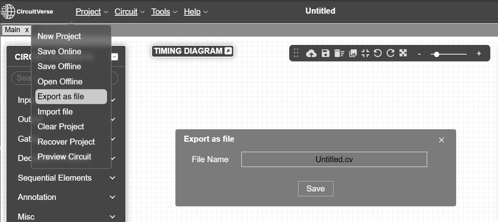

# SimuTest CircuitVerse Digital Logic Test Suite

[CircuitVerse](https://circuitverse.org) is a free, open-source platform which allows users to construct digital logic circuits online. In order to create a more robust testing system for testing these digital logic circuits, Simutest created a testing framework to run exported CircuitVerse circuit files. This framework uses Jest to create and check unit tests programmatically. [Jest](https://jestjs.io) is an easy to use JavaScript testing framework. Users of the test framework simply have to create a series of tests using the Jest Framework and supply a CV file.


## Getting Started

In order to use the Test Suite, you will have to install the SimuTest Test Suite Package. This requires having the package manager NPM installed on your machine. Documentation for how to install Node.js and NPM can be found [here](https://docs.npmjs.com/downloading-and-installing-node-js-and-npm).

Create a folder where ever you plan on installing the package and then open a CLI at that location or navigate to that location. Once you have done that, simply run the following command:

```
npm install SimuTest
```

This will install the package, including all of the required dependencies, and create the folder structure for you to use with your circuits and test files. Notice that within the directory that the package was installed that there is a folder named 'tests'. In this folder, you will find a subfolder named CV. When running tests, we recommend keeping your circuit files within the CV folder. Similarly, we recommend keeping your Jest files within the test folder.

## Exporting your CircuitVerse Circuits

Circuits for this test suite must be built using the CircuitVerse simulator web application.
> [!IMPORTANT]
> Your circuit files MUST have labeled inputs and outputs! These labels are what you will be using in your test files in order to pass and read values from your circuit!

### Manually

From the CircuitVerse simulator with your project open, at the top of the window, click 'Project' and navigate down to 'Export as File'. A window will pop up with a prompt to provide the name of the circuit and a save button. 



Once you've named your file, save the project. Depending on your browser settings, it will either provide a prompt on where to save it or it will automatically save to your downloads folder on your local computer. If the former, simply save the file into the */tests/cv/ folder within your package, and if the latter, simply move the file to the */tests/cv/ folder.

### Using the CV Downloader tool

<!-- TODO -->

## Setting Up Tests

After finishing the setup for the package shown above, as well as downloaded your CV file and moved it to the CV folder, you are ready to start testing your circuits!  

Create a new test.js file for your circuit. We recommend naming it the same as your circuit file. Ex: adder.cv -> adder.test.js

### Loading your circuit in your test file
Open your new test.js file and at the top of the file add the following code:

```Javascript
import {loadProject} from '../src/CircuitLoader';
import {CircuitVerseLoader} from '../src/CircuitLoader/CircuitVerseLoader';

let project;

beforeAll(async () => {
    project = await loadProject(CircuitVerseLoader, 'tests/cv/YOURFILENAMEHERE.cv');
});
```
> [!Note]
> Make sure to replace YOURFILENAMEHERE.cv with the name of your actual circuit file.

This will ensure that when Jest begins running test files, the first thing it does prior to running the actual tests is begin simulating your circuit!

### Writing Tests

<!-- TODO -->

## Running your tests

Running your tests is the easiest part! From the CLI, simply enter the command 
```
npm test
```
Jest will then run through all the test files in your tests folder and check your circuits against your tests. It will then output to your CLI whether your tests have passed or failed. If your tests failed, it will provide the output it received compared to the output it expected.

## Common Issues and Solutions

